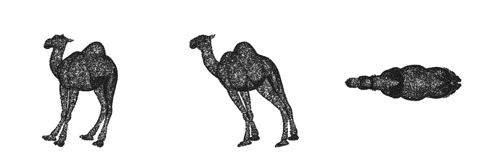
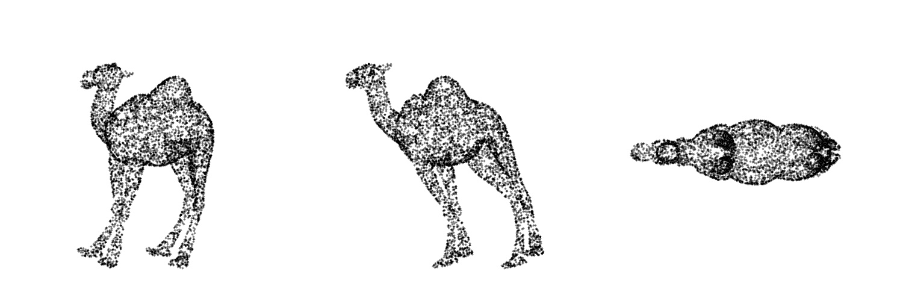

# PointCloudSupterResolution.pytorch

This repository is implementation of AR-GCN(https://arxiv.org/abs/1908.02111) from "Point Cloud Super Resolution with Adversarial Residual Graph Networks" in Pytorch. You can find official Tensorflow implementation [here](https://github.com/wuhuikai/PointCloudSuperResolution).

The model is in `src/model/Generator.py` & `src/model/Discriminator.py`

For further reduce training time, you can borrow CUDA implementation of KNN & Farthest point sampling from such as [PYG](https://github.com/pyg-team/pytorch_geometric)

## Note

You need tqdm, sklearn, h5py installed in your environment, other than standard Pytorch-related packages.
The code is tested under Pytorch 1.8.2(LTS) and Python 3.7 on Windows 10.

## Usage
### Training
You can download training patches in HDF5 format in [here](https://drive.google.com/file/d/1wMtNGvliK_pUTogfzMyrz57iDb_jSQR8/view?usp=sharing).
(Note that the link is not maintained by me. Please refere [PU-Net](https://github.com/yulequan/PU-Net) official repository for the dataset.)
```buildoutcfg
cd src
python train.py # refer 'src/config/train_config.yaml' for training settings
```

### Prediction and Evaluation
You can download evaluation data from author's [official repository](https://github.com/wuhuikai/PointCloudSuperResolution).
```buildoutcfg
cd src
python test.py # refer 'src/config/test_config.yaml' for test settings
```

## Performance

|       |   CD    |   EMD    |
|------:|:-------:|:--------:|
| ResGCN|0.0111   |0.0039    |
| AR-GCN|0.0107   |0.0034    |

### Prediction example

- Ground truth

- Input

- Prediction


### Contact
hk.kim@jbnu.ac.kr